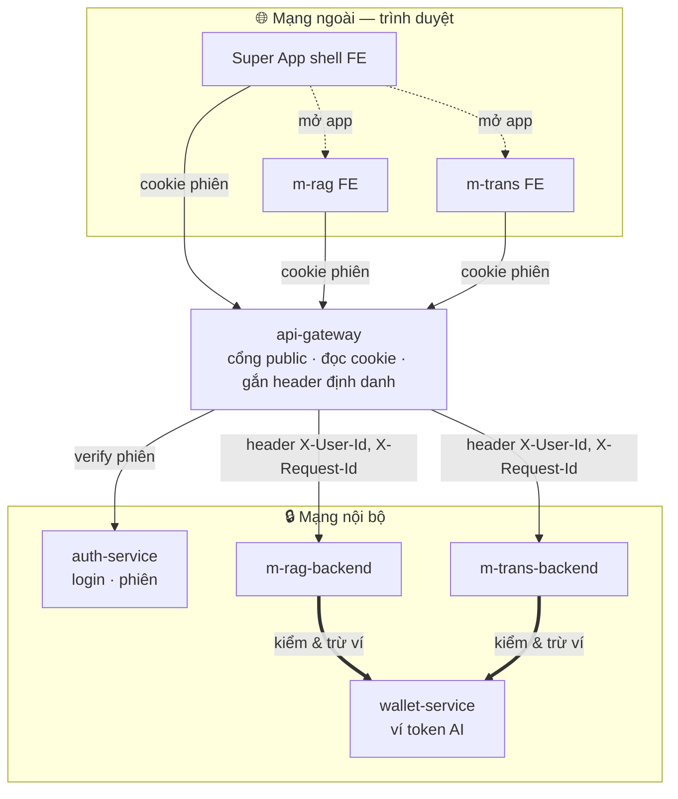
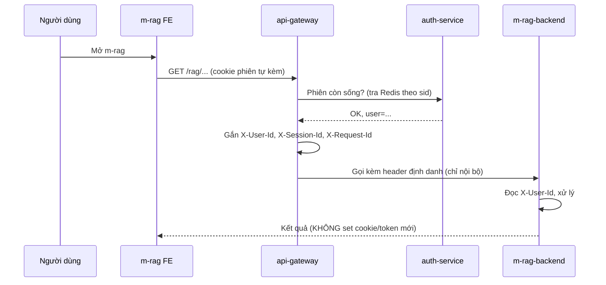
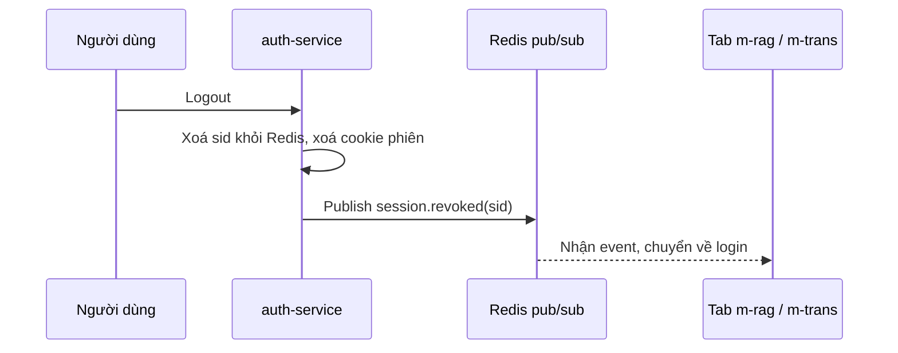
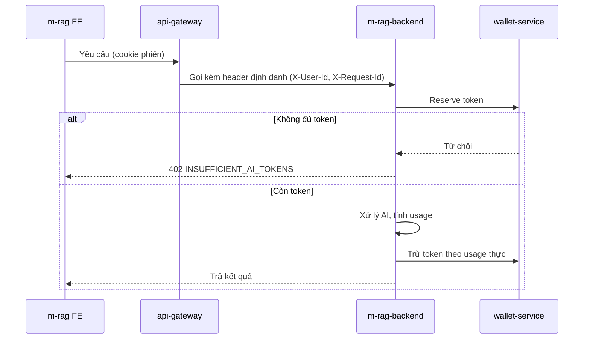

# Migure — Kiến trúc Super App & Mini App AI (Xác thực · Token AI)

> Tài liệu thiết kế cho **Migure**: một **super app web** quản lý đăng nhập chung và **token AI dùng chung**,
> chứa **2 mini app AI**: **m-rag** (RAG/hỏi đáp tài liệu) và **m-trans** (dịch). Hai mini app dùng chung **ví token AI**.
> Phạm vi: **chỉ web**. Tài liệu đặt tên theo **service / app**, không bàn về domain.

---

## 0. Làm rõ phạm vi & thuật ngữ

Có **hai loại "token"** — đều "dùng chung" nhưng khác nhau hoàn toàn:

| Thuật ngữ | Là gì | "Dùng chung" nghĩa là |
|---|---|---|
| **Xác thực (mô hình BFF)** | **Trình duyệt** chỉ giữ **1 cookie phiên HttpOnly**; **api-gateway** đọc cookie, xác thực phiên rồi **gắn header định danh** (`X-User-Id`…) gọi xuống backend. | Đăng nhập 1 lần → 1 cookie dùng chung → vào m-rag/m-trans **không login lại** (SSO). |
| **Token AI (credit/quota)** | Đơn vị tính lượng dùng AI (token/credit nội bộ). | Mỗi user có **1 ví token AI**; cả m-rag và m-trans **tiêu chung** ví đó. |

> **Mô hình BFF (web-only):** credential ở trình duyệt là **1 session cookie HttpOnly**. Không có token nào
> lộ ra trình duyệt. **api-gateway** là cổng public **duy nhất**: xác thực phiên rồi gắn **header định danh nội bộ**
> khi gọi backend. Backend tin gateway vì chỉ **listen mạng nội bộ** — không ai gọi trực tiếp được.

Mục tiêu cốt lõi:

1. **Đăng nhập chung (SSO)** — 1 lần cho cả Super App, m-rag, m-trans.
2. **Logout chung** — thoát ở Super App → mất phiên ở mọi mini app.
3. **Ví token AI dùng chung** — Super App quản lý hạn mức/billing; mọi lệnh xử lý AI (từ app nào) đều trừ vào **1 ví**.

---

## 1. Các service & app

| Tên | Loại | Trách nhiệm |
|---|---|---|
| **Super App (shell)** | FE | App chính: vỏ chứa, điều hướng sang mini app, hiển thị tài khoản/ví. |
| **api-gateway** | Service | Cổng API public **duy nhất**. **Đọc cookie phiên → xác thực phiên với auth-service → gắn header định danh** rồi route sang backend. Là biên CSRF/CORS/rate-limit. |
| **auth-service** | Service (thuộc Super App) | Đăng nhập, **phiên gốc (Redis)**, set/xoá cookie phiên, xác thực phiên theo `sid`. |
| **wallet-service** | Service (thuộc Super App) | Quản lý **ví token AI**: số dư, hạn mức, lịch sử/billing. |
| **m-rag (FE)** | FE | Giao diện mini app RAG. |
| **m-rag-backend** | Service | Backend nghiệp vụ RAG (index tài liệu, retrieval), kiểm ví và xử lý AI. |
| **m-trans (FE)** | FE | Giao diện mini app dịch. |
| **m-trans-backend** | Service | Backend nghiệp vụ dịch, kiểm ví và xử lý AI. |



**FE gọi API như thế nào?** Super App shell và các mini app FE gọi qua **api-gateway**, **chỉ kèm cookie phiên**
(`credentials: include`). Gateway đọc cookie, xác thực phiên với auth-service, rồi **gắn header định danh nội bộ**
(`X-User-Id`, `X-Session-Id`, …) để gọi backend phía sau. **Trình duyệt không bao giờ thấy các header này.**
Chỉ **api-gateway** mở public port; `auth-service`, `wallet-service`, `m-rag-backend`, `m-trans-backend` chỉ
listen trong mạng nội bộ.

**Ai trừ ví?** Việc **trừ ví token AI do BE của mini app làm** (`m-rag-backend` / `m-trans-backend`) thông qua
**wallet-service** — vì BE mới biết ngữ cảnh nghiệp vụ (gọi mấy lượt, có cache không, có tính phí không).
Sau khi kiểm tra/reserve ví, BE mini app xử lý AI và ghi usage thực về **wallet-service**.
Ví token AI dùng chung được gom về 1 nơi nhờ **wallet-service** (mọi BE đều trừ vào cùng ví của user).

---

## 2. Xác thực (BFF: 1 cookie phiên + header định danh) — đăng nhập chung, không login lại

### 2.1 Trình duyệt chỉ giữ 1 thứ: cookie phiên

| Lớp | Dạng | TTL | Ở đâu | Ai dùng |
|---|---|---|---|---|
| **Cookie phiên** | opaque `sid`, **stateful** (Redis) | dài 7–30 ngày (sliding) | **cookie HttpOnly, Secure, SameSite** | trình duyệt ↔ api-gateway |
| **Header định danh** | header HTTP thường (`X-User-Id`…) | theo từng request | **chỉ trong mạng nội bộ** | api-gateway → backend service |

Trình duyệt chỉ giữ **1 cookie phiên** — không token, không JWT. Định danh user được api-gateway **gắn vào header**
khi gọi backend; backend tin gateway vì backend **chỉ nghe mạng nội bộ**.

### 2.2 Header định danh gateway gắn khi gọi backend

```http
X-User-Id:      user_01HX...        # bạn là ai
X-Session-Id:   sess_01HX...        # phiên nào (phục vụ trace)
X-Request-Id:   req_01HX...         # ⭐ correlation id — để log đồng bộ xuyên service
```

- Header định danh chỉ tồn tại **trong mạng nội bộ**; gateway **luôn strip rồi set lại** các header `X-*` này
  để client không thể tự gửi `X-User-Id` giả từ ngoài.
- `X-Request-Id` do gateway sinh ở đầu mỗi request và truyền xuống **mọi** service — xem mục 2.5.
- **Gateway chỉ truyền *danh tính* (`X-User-Id`), không truyền *quyền*.** Không có role/gói dùng chung ở header.
  **Mỗi mini app tự lo phân quyền (authorization) riêng** — backend của nó tự quyết user này được làm gì trong app đó.

### 2.3 Luồng SSO web

Trình duyệt đã có **cookie phiên** sau khi login. Mở mini app nào, trình duyệt **tự gửi kèm cookie**;
api-gateway xác thực phiên rồi gắn header định danh gọi backend.



Mở **m-trans** y hệt — vẫn **cùng 1 cookie**, không login lại. Trình duyệt chỉ nhận về **dữ liệu nghiệp vụ**.

### 2.4 Đăng nhập & gia hạn phiên
- **Login lần đầu:** Google/email → api-gateway → auth-service tạo **phiên gốc** (Redis) + **set cookie HttpOnly**. Login qua IdP ngoài (Google) dùng OAuth redirect + PKCE ở bước này.
- **Gia hạn phiên:** cookie phiên là **sliding**, auth-service gia hạn TTL mỗi lần dùng. Khi cookie hết hạn hoặc bị revoke, request trả `401` và FE chuyển về màn login.
- **Không có vòng đời token riêng:** không có JWT để hết hạn/đúc lại — gateway chỉ check phiên Redis mỗi request.

### 2.5 Log đồng bộ xuyên service (correlation id)

Một request đi qua nhiều service (gateway → m-rag-backend → wallet). Để **nối log** của chúng lại với nhau:

1. **api-gateway sinh `X-Request-Id`** ở đầu mỗi request (nếu chưa có).
2. Truyền `X-Request-Id` xuống **mọi** service nội bộ qua header.
3. **Mọi** service ghi log kèm `request_id` + `user_id` + `session_id`.

```
[gateway]   req_abc | user_123 | POST /rag/ask
[m-rag-be]  req_abc | user_123 | trừ token, gọi AI
[wallet]    req_abc | user_123 | trừ 1500 token
```

→ Tra `req_abc` là thấy **toàn bộ hành trình 1 request** qua mọi service. (Đây là "đồng bộ log" — nối log
bằng 1 id chung, không phải đồng bộ dữ liệu.)

---

## 3. Logout chung (Single Logout)

Thoát ở Super App → mất phiên ở cả m-rag và m-trans, **tức thì**:

1. **Revoke phiên gốc:** auth-service xoá `sid` trong Redis + xoá cookie phiên ⇒ request kế tiếp (kèm cookie) bị
   `401` ngay vì gateway tra Redis không còn phiên ⇒ **không gắn header định danh, không gọi backend nữa**.
2. **Hiệu lực tức thì:** api-gateway check phiên (Redis) ở **mỗi** request trước khi gọi backend; phiên mất thì
   chặn được request kế tiếp ngay lập tức.
3. **Đẩy logout xuống tab đang mở (web):** **Redis pub/sub** + WebSocket/SSE — auth-service phát `session.revoked(sid)`
   → tab m-rag/m-trans đang mở nhận → chuyển về màn login (không cần đợi user bấm gì).



---

## 4. Token AI dùng chung (credit/quota) — phần đặc thù

**m-rag và m-trans tiêu chung 1 ví token AI**, do **wallet-service** quản lý. Việc **trừ ví do BE của mini app**
(`m-rag-backend` / `m-trans-backend`) thực hiện qua wallet-service.

### 4.1 Mô hình ví
Mỗi user có **1 ví token AI** do **wallet-service** quản lý. Mọi lệnh xử lý AI (m-rag hay m-trans) đều trừ vào **cùng ví này**.

### 4.2 Luồng trừ token khi gọi AI



Điểm quan trọng:
- **BE mini app là nơi trừ ví** (qua wallet-service): reserve trước khi gọi, trừ theo usage thực sau khi có kết quả.
- **Khóa gọi AI chỉ nằm ở BE** — FE mini app không giữ.

### 4.3 Phân biệt với định danh phiên
Header định danh **không** chứa số dư token AI (số dư thay đổi liên tục). **Số dư luôn hỏi wallet-service/Redis tại thời điểm gọi.**

---

## 5. Bảo mật (web)

| Rủi ro | Biện pháp |
|---|---|
| XSS đánh cắp credential | Trình duyệt **không giữ token** — chỉ **1 cookie phiên HttpOnly** (JS không đọc được). Bật **CSP**. |
| CSRF (vì cookie tự gửi) | `SameSite=Lax/Strict` + **anti-CSRF token** ở api-gateway cho request đổi state; CORS allowlist các FE. |
| Client giả mạo `X-User-Id` | api-gateway **strip rồi set lại** mọi header `X-*` định danh; client từ ngoài không bao giờ tự đặt được. |
| Gọi thẳng service nội bộ (bỏ qua gateway) | Chỉ public `api-gateway`; các service/backend còn lại chỉ listen internal network. mTLS giữa gateway↔service nếu cần siết thêm. |
| Lộ khóa gọi AI | Chỉ BE giữ key; không đưa key xuống FE. |
| Đốt token AI | reserve + trừ theo usage thực + rate-limit theo user/app. |
| Phiên còn sống sau logout | Phiên **stateful (Redis)** → xoá là chết **tức thì**; gateway check phiên trước mỗi request. |

> **Đánh đổi của bản đơn giản:** an toàn dựa trên nguyên tắc **"chỉ gateway gọi được backend"** (mạng nội bộ +
> strip header), thay vì chữ ký số. Phù hợp app nội bộ vừa/nhỏ. Muốn siết hơn thì bật **mTLS** giữa gateway↔service.

---

## 6. Lộ trình triển khai

| Phase | Nội dung |
|---|---|
| **P0** | api-gateway public + service internal-only; auth-service login + **phiên gốc (Redis) + cookie HttpOnly**; gateway **xác thực phiên + gắn header định danh** (`X-User-Id`, `X-Session-Id`, `X-Request-Id`). |
| **P1** | **SSO bằng cookie** → mở m-rag & m-trans tự gửi cookie, gateway gắn header, không login lại. |
| **P2** | **wallet-service** + xử lý AI trong BE mini app: ví token AI (reserve + trừ thực). |
| **P3** | **Logout chung**: revoke session + Redis pub/sub đẩy logout cho tab đang mở. |
| **P4** | **Log đồng bộ**: correlation id (`X-Request-Id`) xuyên service + trang thống kê usage. |
| **P5** | Hardening: CSP, rate-limit nâng cao, strip header chặt, audit/anomaly (mTLS giữa gateway↔service nếu cần siết). |

---

## 7. Tóm tắt

- **Mô hình BFF (web-only)**: trình duyệt chỉ giữ **1 cookie phiên HttpOnly**; **api-gateway** đọc cookie → verify phiên (Redis) → **gắn header định danh** (`X-User-Id`…) gọi backend. Không token nào lộ ra trình duyệt.
- **Super App** = vỏ FE; **api-gateway** = cổng public duy nhất; phía sau `auth-service`, `wallet-service`, backend mini app chỉ chạy nội bộ.
- **Đăng nhập chung**: login 1 lần → **1 cookie phiên dùng chung** → mở m-rag/m-trans không login lại. Cookie **sliding** tự gia hạn.
- **Logout chung**: xoá phiên Redis + cookie → **tức thì** (gateway check phiên mỗi request) + Redis pub/sub đẩy logout cho tab đang mở.
- **Token AI dùng chung**: 1 ví/user; **BE mini app trừ ví qua wallet-service** (reserve trước, trừ theo usage thực).
- **Log đồng bộ**: gateway sinh `X-Request-Id`, mọi service log chung id đó → trace 1 request xuyên toàn hệ thống.

### Tham chiếu
- OAuth 2.0 (RFC 6749), PKCE (RFC 7636) — *cho login lần đầu qua IdP ngoài*; **BFF pattern** (OAuth 2.0 for Browser-Based Apps — Security BCP).
