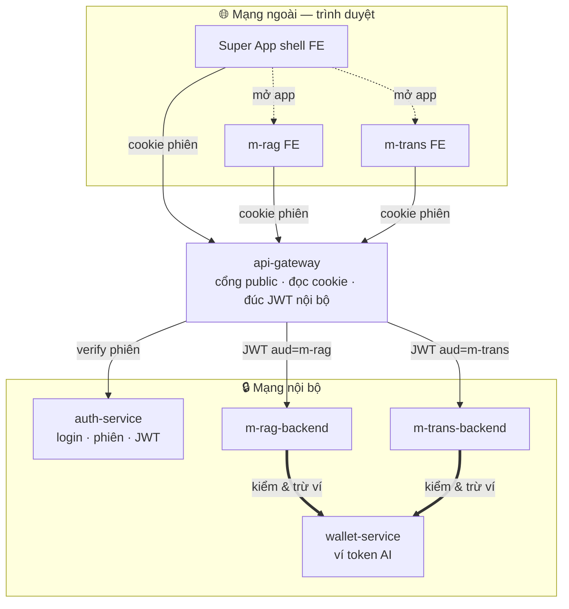
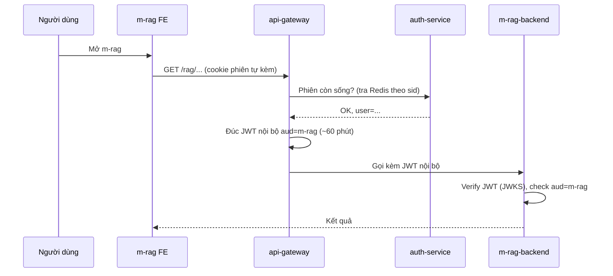
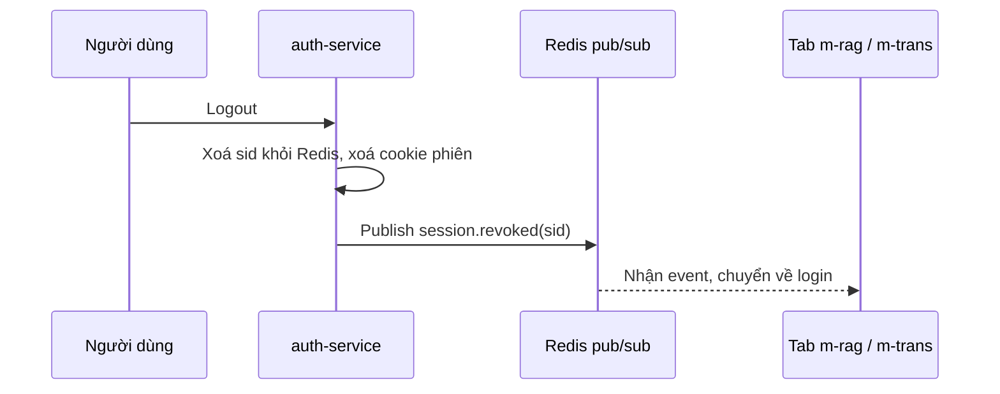
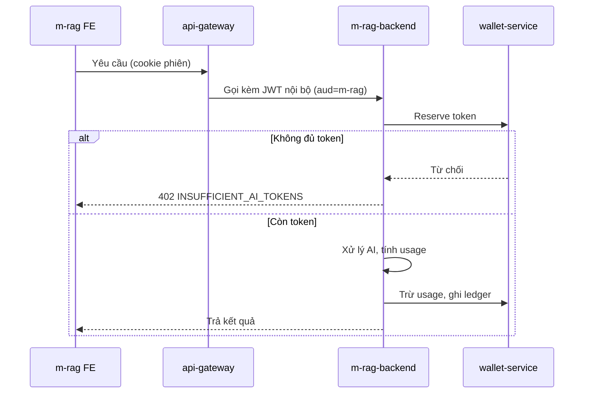

# Migure — Kiến trúc Super App & Mini App AI (Xác thực · Token AI)

> Tài liệu thiết kế cho **Migure**: một **super app web** quản lý đăng nhập chung và **token AI dùng chung**,
> chứa **2 mini app AI**: **m-rag** (RAG/hỏi đáp tài liệu) và **m-trans** (dịch). Hai mini app dùng chung **ví token AI**.
> Phạm vi: **chỉ web**. Tài liệu đặt tên theo **service / app**, không bàn về domain.

---

## 0. Làm rõ phạm vi & thuật ngữ

Có **hai loại "token"** — đều "dùng chung" nhưng khác nhau hoàn toàn:

| Thuật ngữ | Là gì | "Dùng chung" nghĩa là |
|---|---|---|
| **Xác thực (mô hình BFF)** | **Trình duyệt** chỉ giữ **cookie phiên HttpOnly**; **api-gateway** đọc cookie rồi **đúc JWT nội bộ** (có `aud`) để gọi xuống service. | Đăng nhập 1 lần → cookie dùng chung → vào m-rag/m-trans **không login lại** (SSO). |
| **Token AI (credit/quota)** | Đơn vị tính lượng dùng AI (token/credit nội bộ). | Mỗi user có **1 ví token AI**; cả m-rag và m-trans **tiêu chung** ví đó. |

> **Mô hình BFF (web-only):** credential ở trình duyệt là **session cookie HttpOnly**. JWT chạy **nội bộ**
> giữa api-gateway và các service phía sau, giữ **cô lập `aud`** và cho backend verify **stateless**.

Mục tiêu cốt lõi:

1. **Đăng nhập chung (SSO)** — 1 lần cho cả Super App, m-rag, m-trans.
2. **Logout chung** — thoát ở Super App → mất phiên ở mọi mini app.
3. **Ví token AI dùng chung** — Super App quản lý hạn mức/billing; mọi lệnh xử lý AI (từ app nào) đều trừ vào **1 ví**.

---

## 1. Các service & app

| Tên | Loại | Trách nhiệm |
|---|---|---|
| **Super App (shell)** | FE | App chính: vỏ chứa, điều hướng sang mini app, hiển thị tài khoản/ví. |
| **api-gateway** | Service | Cổng API public **duy nhất**. **Đọc cookie phiên → xác thực phiên với auth-service → đúc JWT nội bộ (`aud`)** rồi route sang backend. Là biên CSRF/CORS/rate-limit. |
| **auth-service** | Service (thuộc Super App) | Đăng nhập, **phiên gốc (Redis)**, set/xoá cookie phiên, cấp & verify **JWT nội bộ (RS256)**, JWKS. |
| **wallet-service** | Service (thuộc Super App) | Quản lý **ví token AI**: số dư, hạn mức, lịch sử/billing. |
| **m-rag (FE)** | FE | Giao diện mini app RAG. |
| **m-rag-backend** | Service | Backend nghiệp vụ RAG (index tài liệu, retrieval), kiểm ví và xử lý AI. |
| **m-trans (FE)** | FE | Giao diện mini app dịch. |
| **m-trans-backend** | Service | Backend nghiệp vụ dịch, kiểm ví và xử lý AI. |



**FE gọi API như thế nào?** Super App shell và các mini app FE gọi qua **api-gateway**, **chỉ kèm cookie phiên**
(`credentials: include`) — **không** gắn header `Authorization: Bearer`. Gateway đọc cookie, xác thực phiên với
auth-service, rồi **đúc một JWT nội bộ ngắn hạn** (`aud` đúng app) để gọi backend phía sau. **Trình duyệt không
bao giờ thấy JWT này.** Chỉ **api-gateway** mở public port; `auth-service`, `wallet-service`, `m-rag-backend`,
`m-trans-backend` chỉ listen trong mạng nội bộ.

**Ai trừ ví?** Việc **trừ ví token AI do BE của mini app làm** (`m-rag-backend` / `m-trans-backend`) thông qua
**wallet-service** — vì BE mới biết ngữ cảnh nghiệp vụ (gọi mấy lượt, có cache không, có tính phí không).
Sau khi kiểm tra/reserve ví, BE mini app xử lý AI và ghi usage thực về **wallet-service**.
Ví token AI dùng chung được gom về 1 nơi nhờ **wallet-service** (mọi BE đều trừ vào cùng ví của user).

---

## 2. Xác thực (BFF: cookie phiên + JWT nội bộ) — đăng nhập chung, không login lại

### 2.1 Hai lớp credential

| Lớp | Dạng | TTL | Ở đâu | Ai dùng |
|---|---|---|---|---|
| **Cookie phiên** | opaque `sid`, **stateful** (Redis) | dài 7–30 ngày (sliding) | **cookie HttpOnly, Secure, SameSite** | trình duyệt ↔ api-gateway |
| **JWT nội bộ** | JWT RS256, **stateless**, có `aud` | ngắn (~60 phút) | **chỉ trong mạng nội bộ** | api-gateway → backend service |

Trình duyệt chỉ giữ **cookie phiên**. JWT nội bộ do api-gateway đúc khi cần và chỉ truyền trong mạng nội bộ; backend verify stateless qua JWKS.

### 2.2 Claims của JWT nội bộ

```jsonc
{
  "iss": "auth-service",
  "sub": "user_01HX...",   // user id
  "aud": "m-rag",          // ⭐ JWT này CHỈ gọi được m-rag-backend
  "sid": "sess_01HX...",   // session id
  "iat": 1733400000,
  "exp": 1733403600        // ~60 phút
}
```

`aud` tách biệt: JWT đúc cho m-rag chỉ gọi được m-rag-backend. Mỗi backend chỉ nhận đúng `aud` của mình.
api-gateway chỉ đúc JWT khi phiên (Redis) còn sống.

### 2.3 Luồng SSO web

Trình duyệt đã có **cookie phiên** sau khi login. Mở mini app nào, trình duyệt **tự gửi kèm cookie**;
api-gateway xác thực phiên rồi đúc JWT gọi backend.



Chừng nào cookie phiên còn sống, mọi request đều chạy qua luồng trên.

### 2.4 Đăng nhập & gia hạn phiên
- **Login lần đầu:** Google/email → api-gateway → auth-service tạo **phiên gốc** (Redis) + **set cookie HttpOnly**. Login qua IdP ngoài (Google) dùng OAuth redirect + PKCE ở bước này.
- **Gia hạn phiên:** cookie phiên là **sliding**, auth-service gia hạn TTL mỗi lần dùng. Khi cookie hết hạn hoặc bị revoke, request trả `401` và FE chuyển về màn login.
- **JWT nội bộ:** hết hạn thì api-gateway đúc cái mới cho request kế tiếp.

---

## 3. Logout chung (Single Logout)

Thoát ở Super App → mất phiên ở cả m-rag và m-trans, **tức thì**:

1. **Revoke phiên gốc:** auth-service xoá `sid` trong Redis + xoá cookie phiên ⇒ request kế tiếp (kèm cookie) bị
   `401` ngay vì gateway tra Redis không còn phiên ⇒ **không đúc được JWT nội bộ nữa**.
2. **Hiệu lực tức thì:** api-gateway check phiên (Redis) ở **mỗi** request trước khi gọi backend; phiên mất thì
   không gọi backend nữa, nên logout chặn được request kế tiếp ngay lập tức (không phụ thuộc TTL của JWT nội bộ).
3. **Đẩy logout xuống tab đang mở (web):** **Redis pub/sub** + WebSocket/SSE — auth-service phát `session.revoked(sid)`
   → tab m-rag/m-trans đang mở nhận → chuyển về màn login (không cần đợi user bấm gì).



---

## 4. Token AI dùng chung (credit/quota) — phần đặc thù

**m-rag và m-trans tiêu chung 1 ví token AI**, do **wallet-service** quản lý. Việc **trừ ví do BE của mini app**
(`m-rag-backend` / `m-trans-backend`) thực hiện qua wallet-service.

### 4.1 Mô hình ví (wallet/ledger)
```
Mỗi user có 1 VÍ token AI:
  - balance        : token/credit còn lại
  - monthly_quota  : hạn mức theo gói (free/pro/team)
  - reset_at       : mốc cấp lại quota
Mỗi lần xử lý AI (m-rag hay m-trans) → trừ vào CÙNG ví này.
```
- **Nguồn sự thật số dư:** DB (wallet-service) — bảng `ai_wallet` + `ai_usage_ledger` ghi từng giao dịch (audit/billing).
- **Đếm nhanh & chống vượt hạn mức:** Redis counter số dư (atomic `DECRBY`), đồng bộ định kỳ về DB.

### 4.2 Luồng trừ token khi gọi AI



Điểm quan trọng:
- **BE mini app là nơi trừ ví** (qua wallet-service): reserve trước khi gọi, trừ theo usage thực sau khi có kết quả.
- **Ghi `app` (m-rag/m-trans) vào ledger** ⇒ ví chung nhưng vẫn biết app nào tiêu bao nhiêu.
- **Khóa gọi AI chỉ nằm ở BE** — FE mini app không giữ.

### 4.3 Phân biệt với token xác thực
JWT **không** chứa số dư token AI (số dư thay đổi liên tục). **Số dư luôn hỏi wallet-service/Redis tại thời điểm gọi.**

---

## 5. Bảo mật (web)

| Rủi ro | Biện pháp |
|---|---|
| XSS đánh cắp credential | Trình duyệt **không giữ token** — chỉ **cookie phiên HttpOnly** (JS không đọc được). Bật **CSP**. |
| CSRF (vì cookie tự gửi) | `SameSite=Lax/Strict` + **anti-CSRF token** ở api-gateway cho request đổi state; CORS allowlist các FE. |
| JWT m-rag dùng nhầm sang m-trans | `aud` hẹp; backend verify đúng `aud`. JWT chỉ trong nội bộ. |
| Lộ JWT nội bộ | JWT sống ~60 phút + chỉ truyền trong mạng nội bộ (mTLS giữa gateway↔service nếu cần). |
| Lộ khóa gọi AI | Chỉ BE giữ key; không đưa key xuống FE. |
| Đốt token AI | reserve + trừ theo usage thực + rate-limit theo user/app. |
| Gọi thẳng service nội bộ | Chỉ public `api-gateway`; các service/backend còn lại chỉ listen internal network. |
| Lộ private key ký JWT | RS256 + JWKS, key trong vault/KMS, rotation theo `kid`. |
| Phiên còn sống sau logout | Phiên **stateful (Redis)** → xoá là chết **tức thì**; gateway check phiên trước mỗi lần đúc JWT. |

---

## 6. Gợi ý dữ liệu

```
users              (user_id, email, created_at)
sessions           (sid, user_id, created_at, revoked_at)         // hoặc Redis
ai_wallet          (user_id, balance, monthly_quota, reset_at)
ai_usage_ledger    (id, user_id, app, ai_engine, prompt_tokens,
                    completion_tokens, cost, created_at)           // audit + billing
```
Redis: `session:<sid>`, `wallet:<user_id>` (counter), `ratelimit:<user>:<app>:<window>`, kênh pub/sub `session.revoked`.

---

## 7. Lộ trình triển khai

| Phase | Nội dung |
|---|---|
| **P0** | api-gateway public + service internal-only; auth-service login + **phiên gốc (Redis) + cookie HttpOnly**; gateway đúc **JWT nội bộ RS256 + JWKS** (có `aud`, `sid`). |
| **P1** | **SSO bằng cookie** → mở m-rag & m-trans tự gửi cookie, gateway đúc JWT, không login lại. |
| **P2** | **wallet-service** + xử lý AI trong BE mini app: ví token AI (reserve + trừ thực + ledger). |
| **P3** | **Logout chung**: revoke session + Redis pub/sub đẩy logout cho tab đang mở. |
| **P4** | Trang thống kê usage. |
| **P5** | Hardening: CSP, rate-limit nâng cao, key rotation, audit/anomaly. |

---

## 8. Tóm tắt

- **Mô hình BFF (web-only)**: trình duyệt chỉ giữ **cookie phiên HttpOnly**; **api-gateway** đọc cookie → verify phiên (Redis) → **đúc JWT nội bộ (`aud`)** gọi backend.
- **Super App** = vỏ FE; **api-gateway** = cổng public duy nhất; phía sau `auth-service`, `wallet-service`, backend mini app chỉ chạy nội bộ.
- **Đăng nhập chung**: login 1 lần → cookie phiên dùng chung → mở m-rag/m-trans không login lại. Cookie **sliding** tự gia hạn.
- **Logout chung**: xoá phiên Redis + cookie → **tức thì** (gateway check phiên trước khi đúc JWT) + Redis pub/sub đẩy logout cho tab đang mở.
- **Token AI dùng chung**: 1 ví/user; **BE mini app trừ ví qua wallet-service** (reserve trước, trừ theo usage thực, ghi ledger). JWT **không** chứa số dư.

### Tham chiếu
- OAuth 2.0 (RFC 6749), PKCE (RFC 7636) — *cho login lần đầu qua IdP ngoài*; JWT (RFC 7519), JWKS (RFC 7517); **BFF pattern** (OAuth 2.0 for Browser-Based Apps — Security BCP).
