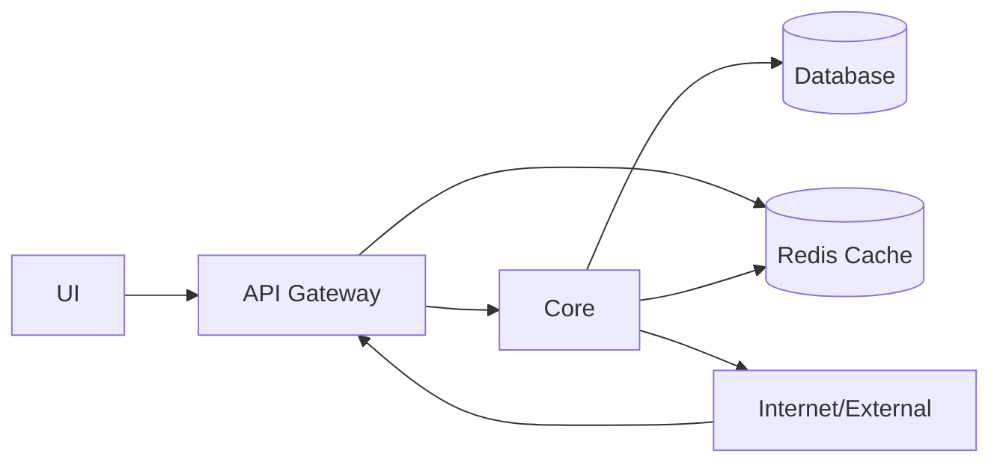
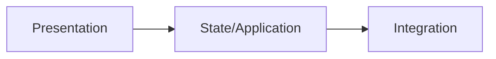
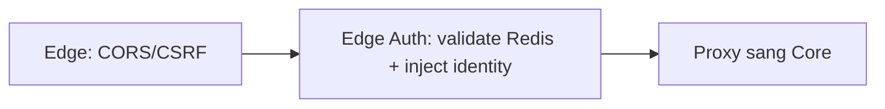
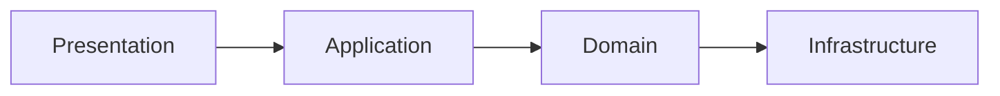
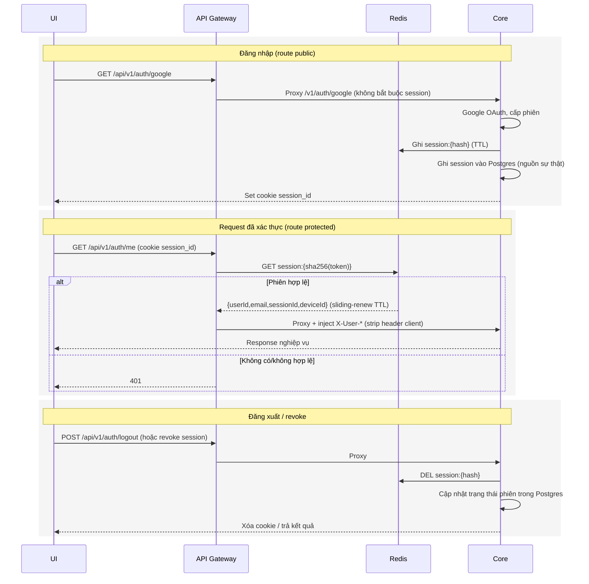
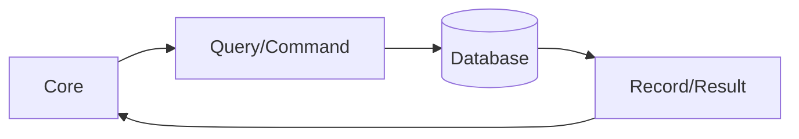
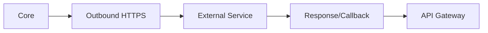
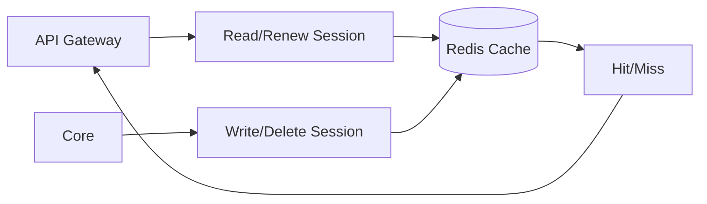

# Kiến trúc hệ thống

## 1. Mục tiêu tài liệu
- Trình bày kiến trúc tổng quát của dự án theo mô hình API Gateway đứng trước service nghiệp vụ.
- Làm rõ vai trò của UI, API Gateway, Core, Database, Redis Cache, Internet/External.

## 2. Kiến trúc tổng quát toàn dự án (Gateway + Core)

| Thành phần | Vai trò |
|---|---|
| UI | Nhận thao tác người dùng, hiển thị dữ liệu và gọi API. UI luôn gọi vào API Gateway (cổng public `8000`). |
| API Gateway | Điểm vào public duy nhất (port `8000`). Xử lý edge concerns (CORS allowlist, CSRF Origin/Referer), xác thực edge bằng cookie `session_id` đối chiếu trực tiếp Redis, strip header `X-User-*` do client gửi (chống spoof), inject identity tin cậy rồi proxy `/api/*` sang core (strip prefix `/api`, forward phần còn lại `/v1/...`). `/api` là namespace public duy nhất cho mọi backend API hiện tại và tương lai. |
| Core | Service nội bộ (port `8001`, đổi tên từ `api`). Xử lý đăng nhập Google OAuth, cấp/refresh/switch phiên, quản lý device/account, revoke. Endpoint protected tin cậy header `X-User-Id` do gateway inject thay vì tự validate cookie. |
| Database | Lưu trữ dữ liệu nghiệp vụ và là nguồn sự thật bền vững cho phiên/thiết bị/audit. |
| Redis Cache | Store validate phiên tốc độ cao (`session:{sha256(token)}` -> `{userId,email,sessionId,deviceId}`) cho gateway, cùng dữ liệu cache/token tạm thời. |
| Internet/External | Dịch vụ bên ngoài giao tiếp qua outbound/callback/webhook (callback Google trỏ về gateway). |

> Cô lập "core chỉ gọi được qua gateway" bằng network isolation được hoãn sang giai đoạn Docker sau này; local mọi service nằm trên localhost nên đây là hạng mục đã biết, chưa enforce.

## 3. Vai trò các khối chính
| Khối | Input chính | Output chính |
|---|---|---|
| UI | User action, route params | HTTP request tới API Gateway, giao diện hiển thị |
| API Gateway | HTTP request từ UI, callback từ dịch vụ ngoài | Request đã được xác thực + inject identity proxy sang core, hoặc 401 nếu thiếu phiên hợp lệ |
| Core | Request đã proxy kèm header identity tin cậy từ gateway | JSON response, truy vấn DB, ghi/xóa session Redis, gọi dịch vụ ngoài |
| Database | Query/Command từ core | Bản ghi dữ liệu |
| Redis Cache | Validate/ghi/xóa session từ gateway và core | Dữ liệu session hit/miss theo key |
| Internet/External | Outbound call từ core | Response/callback/webhook |

## 4. Kiến trúc chi tiết theo khối

### 4.1 Kiến trúc Frontend

| Node trong sơ đồ | Thành phần và nhiệm vụ |
|---|---|
| Presentation | Page/Component render giao diện và nhận tương tác người dùng. |
| State/Application | Hook/Store/Query quản lý state và điều phối luồng xử lý UI. |
| Integration | API client gọi backend và mapping dữ liệu trả về. |

### 4.2 Kiến trúc API Gateway

| Node trong sơ đồ | Thành phần và nhiệm vụ |
|---|---|
| Edge: CORS/CSRF | Áp dụng CORS allowlist và kiểm tra Origin/Referer chống CSRF cho mọi request public. |
| Edge Auth | Đọc token từ cookie `session_id`, hash SHA-256 và đối chiếu key `session:{hash}` trong Redis; strip mọi header `X-User-*` client gửi rồi inject `X-User-Id`, `X-User-Email`, `X-Session-Id`, `X-Device-Id` tin cậy. Route public (`/api/v1/auth/google`, `/api/v1/auth/google/callback`, `/api/v1/auth/switch`, `/api/v1/auth/logout`, `/api/v1/auth/accounts`) đi qua không bắt buộc session; route protected (`/api/v1/auth/me`, `/api/v1/auth/devices`, `/api/v1/auth/sessions/:id`, `/api/v1/users` và mọi `/api/v1/...` khác trong tương lai) thiếu phiên hợp lệ trả 401. |
| Proxy sang Core | Dùng `http-proxy-middleware` chuyển tiếp `/api/*` sang core (`CORE_URL`): strip prefix `/api` rồi forward phần còn lại `/v1/...` (vd `/api/v1/auth/me` -> core `/v1/auth/me`). Versioning đặt ở cấp controller core (`v1/auth`, `v1/users`), không phải global prefix. |

> Xử lý lỗi & resilience (Gateway): mọi trường hợp lỗi đều trả envelope chuẩn `{success:false, code, message}` với code chuẩn (đồng bộ core/FE). Global exception filter suy code chuẩn cho mọi exception (kể cả `HttpException` không phải `AppException` → map theo status) và log 5xx qua pino kèm `reqId/method/url`. Bảng case → code → HTTP:
>
> | Trường hợp | Code | HTTP |
> |---|---|---|
> | Chưa xác thực / thiếu phiên | `AUTH_001` | 401 |
> | Phiên bị revoke (propagate từ core) | `AUTH_004` | 401 |
> | Phiên hết hạn (propagate từ core) | `AUTH_005` | 401 |
> | CSRF / Origin không hợp lệ | `AUTH_006` | 403 |
> | Route lạ không thuộc `/api` | `SYS_404` | 404 |
> | Core không kết nối được (proxy `on.error`) | `SYS_502` | 502 |
> | Không verify được phiên (Redis lẫn core đều lỗi) | `SYS_503` | 503 |
> | Core timeout (`proxyTimeout`/`PROXY_TIMEOUT_MS`) | `SYS_504` | 504 |
> | Lỗi nội bộ | `SYS_001` | 500 |
>
> - Proxy có `proxyTimeout` + handler `on.error` → core unreachable trả `SYS_502`, timeout trả `SYS_504` (không còn 504 thô), kèm log pino có `errCode`.
> - Resilience auth: Redis chết lúc chạy → degrade sang core introspect (không 500), introspect propagate đúng code core (`AUTH_001/004/005`); cả Redis lẫn core đều lỗi → `SYS_503`.
> - Boot không crash: Redis chết lúc khởi động → gateway vẫn boot (connect nền + retry), chạy degraded tới khi Redis hồi.
> - `GET /health`: liveness endpoint (không proxy), trả `{ status: 'ok' }` 200.
> - `bodyParser: false` ở gateway (proxy thuần) để không nuốt body POST trước khi forward.

### 4.3 Kiến trúc Core

| Node trong sơ đồ | Thành phần và nhiệm vụ |
|---|---|
| Presentation | Controller nhận request đã proxy, đọc identity từ header gateway qua `GatewayUserGuard`, trả response chuẩn. |
| Application | Service/Use case điều phối nghiệp vụ xác thực, phiên, device/account. |
| Domain | Entity/Rule/Policy chứa logic nghiệp vụ cốt lõi. |
| Infrastructure | Repository/Client kết nối DB, Redis và dịch vụ ngoài. |

### 4.4 Luồng xác thực qua gateway

> Mô hình phiên: Redis là store validate nhanh (gateway đọc, tự sliding-renew TTL); Postgres là nguồn sự thật bền vững cho liệt kê device/session, remote revoke và audit. Sliding-renew chỉ diễn ra ở Redis nên `expires_at` trong Postgres có thể trễ — chấp nhận được vì listing/audit không cần độ chính xác từng giây.

> Cache-aside (tự lành khi Redis mất): khi gateway tra Redis bị miss mà request vẫn có cookie session, gateway gọi nội bộ `POST /api/v1/auth/introspect` (gateway gọi `CORE_URL/v1/auth/introspect`) của core; core đối chiếu Postgres (nguồn sự thật), nếu phiên còn hợp lệ thì ghi lại key vào Redis (rehydrate) và trả identity cho gateway. Nhờ vậy Redis bị restart/flush sạch không làm user mất phiên — request đầu của mỗi user tự nạp lại cache, các request sau lại đọc nhanh từ Redis. Gateway vẫn KHÔNG kết nối DB; core là nơi duy nhất chạm Postgres. Phiên đã revoke (Postgres `is_revoked`) sẽ không bị introspect hồi sinh.

> Logging: cả gateway + core dùng `nestjs-pino` → log JSON ra **stdout** (không ghi file; phù hợp microservice, để collector/Docker thu gom sau). Gateway sinh/nhận `X-Request-Id` và forward xuống core; mọi log mang cùng `reqId` + field `service` (`gateway`/`core`) → trace được 1 request xuyên service. Dev dùng `pino-pretty`, prod xuất JSON thô; mức log qua `LOG_LEVEL` (mặc định `info`); redact các field nhạy cảm (cookie/authorization/secret). (Định hướng) Phase sau khi dockerize sẽ gom stdout về log tập trung (Loki/ELK/hosted).

### 4.5 Kiến trúc Database

| Node trong sơ đồ | Thành phần và nhiệm vụ |
|---|---|
| Core | Tầng duy nhất được phép đọc/ghi database theo business rule. |
| Query/Command | Lệnh truy vấn/cập nhật dữ liệu do application layer phát sinh. |
| Database | Lưu trữ dữ liệu bền vững, đảm bảo toàn vẹn dữ liệu. |
| Record/Result | Kết quả dữ liệu trả về để core chuẩn hóa response. |

### 4.6 Kiến trúc Internet/External

| Node trong sơ đồ | Thành phần và nhiệm vụ |
|---|---|
| Core | Điều phối tích hợp, kiểm soát timeout/retry/log cho luồng ngoài. |
| Outbound HTTPS | Kênh gọi ra dịch vụ bên ngoài. |
| External Service | Hệ thống thứ ba cung cấp dữ liệu/chức năng tích hợp (vd Google OAuth). |
| Response/Callback | Dữ liệu phản hồi hoặc callback/webhook; callback Google quay lại qua gateway với `redirect_uri` = `http://localhost:8000/api/v1/auth/google/callback` (core `google.strategy` build từ `API_URL` + `/api/v1/auth/google/callback`). |

### 4.7 Kiến trúc Redis Cache

| Node trong sơ đồ | Thành phần và nhiệm vụ |
|---|---|
| API Gateway | Đọc `session:{hash}` để validate edge và sliding-renew TTL. |
| Core | Ghi session khi create/refresh/switch, xóa key khi logout/revoke. |
| Read/Renew Session | Lớp thao tác đọc + gia hạn TTL của gateway. |
| Write/Delete Session | Lớp thao tác ghi/xóa session của core. |
| Redis Cache | Bộ nhớ key-value tốc độ cao cho session và dữ liệu tạm thời. |
| Hit/Miss | Trạng thái phiên còn hợp lệ hay không để quyết định proxy hoặc trả 401. |
