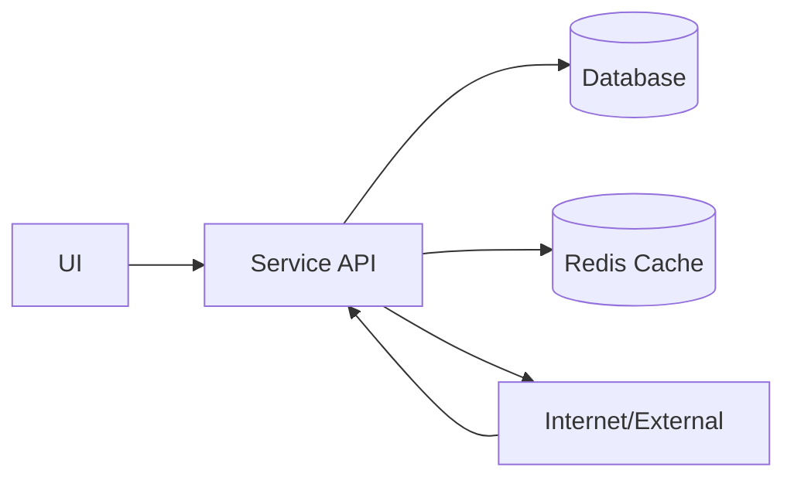
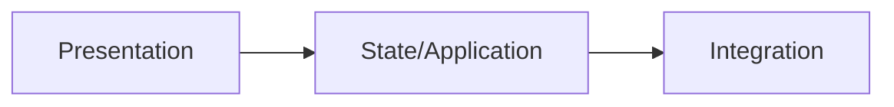
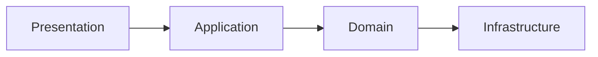
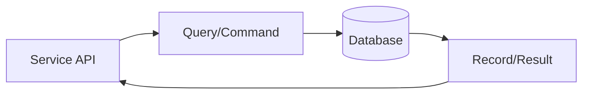
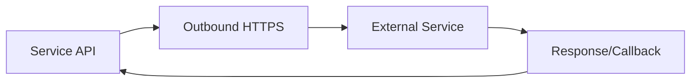
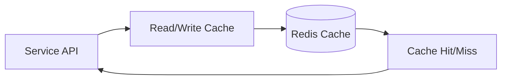

# Kiến trúc hệ thống

## 1. Mục tiêu tài liệu
- Trình bày kiến trúc tổng quát của dự án theo mô hình monolith.
- Làm rõ vai trò của UI, Service API, Database, Redis Cache, Internet/External.

## 2. Kiến trúc tổng quát toàn dự án (Monolith)

| Thành phần | Vai trò |
|---|---|
| UI | Nhận thao tác người dùng, hiển thị dữ liệu và gọi API. |
| Service API | Một service backend tập trung xử lý toàn bộ nghiệp vụ và tích hợp theo mô hình monolith. |
| Database | Lưu trữ dữ liệu nghiệp vụ của hệ thống. |
| Redis Cache | Lưu dữ liệu truy xuất nhanh (cache/session/token/rate-limit data). |
| Internet/External | Dịch vụ bên ngoài giao tiếp qua outbound/callback/webhook. |

## 3. Vai trò các khối chính
| Khối | Input chính | Output chính |
|---|---|---|
| UI | User action, route params | HTTP request tới API, giao diện hiển thị |
| Service API | HTTP request từ UI hoặc callback/webhook | JSON response, truy vấn DB, gọi dịch vụ ngoài |
| Database | Query/Command từ Service API | Bản ghi dữ liệu |
| Redis Cache | Cache command từ Service API | Dữ liệu cache hit/miss theo key |
| Internet/External | Outbound call từ Service API | Response/callback/webhook |

## 4. Kiến trúc chi tiết theo khối

### 4.1 Kiến trúc Frontend

| Node trong sơ đồ | Thành phần và nhiệm vụ |
|---|---|
| Presentation | Page/Component render giao diện và nhận tương tác người dùng. |
| State/Application | Hook/Store/Query quản lý state và điều phối luồng xử lý UI. |
| Integration | API client gọi backend và mapping dữ liệu trả về. |

### 4.2 Kiến trúc Service API (Monolith)

| Node trong sơ đồ | Thành phần và nhiệm vụ |
|---|---|
| Presentation | Controller nhận request, validate đầu vào, trả response chuẩn. |
| Application | Service/Use case điều phối nghiệp vụ trong monolith. |
| Domain | Entity/Rule/Policy chứa logic nghiệp vụ cốt lõi. |
| Infrastructure | Repository/Client kết nối DB và dịch vụ ngoài. |

### 4.3 Kiến trúc Database

| Node trong sơ đồ | Thành phần và nhiệm vụ |
|---|---|
| Service API | Tầng duy nhất được phép đọc/ghi database theo business rule. |
| Query/Command | Lệnh truy vấn/cập nhật dữ liệu do application layer phát sinh. |
| Database | Lưu trữ dữ liệu bền vững, đảm bảo toàn vẹn dữ liệu. |
| Record/Result | Kết quả dữ liệu trả về để API chuẩn hóa response. |

### 4.4 Kiến trúc Internet/External

| Node trong sơ đồ | Thành phần và nhiệm vụ |
|---|---|
| Service API | Điều phối tích hợp, kiểm soát timeout/retry/log cho luồng ngoài. |
| Outbound HTTPS | Kênh API gọi ra dịch vụ bên ngoài. |
| External Service | Hệ thống thứ ba cung cấp dữ liệu/chức năng tích hợp. |
| Response/Callback | Dữ liệu phản hồi hoặc callback/webhook quay lại API. |

### 4.5 Kiến trúc Redis Cache

| Node trong sơ đồ | Thành phần và nhiệm vụ |
|---|---|
| Service API | Đọc/ghi cache theo key để giảm tải truy vấn DB. |
| Read/Write Cache | Lớp thao tác cache (set/get/del/expire). |
| Redis Cache | Bộ nhớ key-value tốc độ cao cho dữ liệu tạm thời. |
| Cache Hit/Miss | Trạng thái cache có dữ liệu hoặc không có dữ liệu để quyết định fallback DB. |
