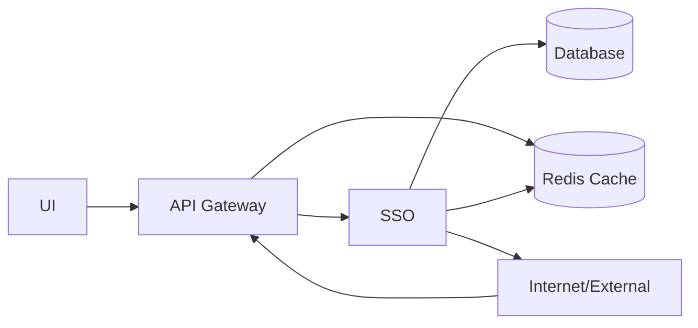
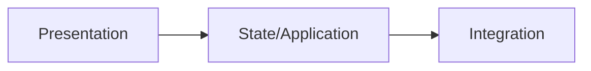
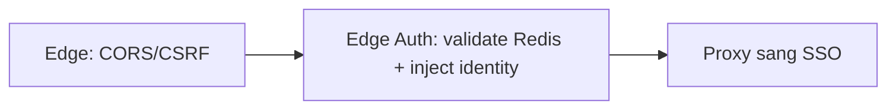
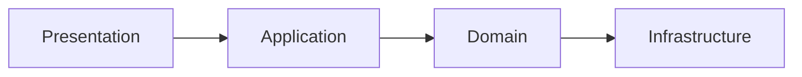
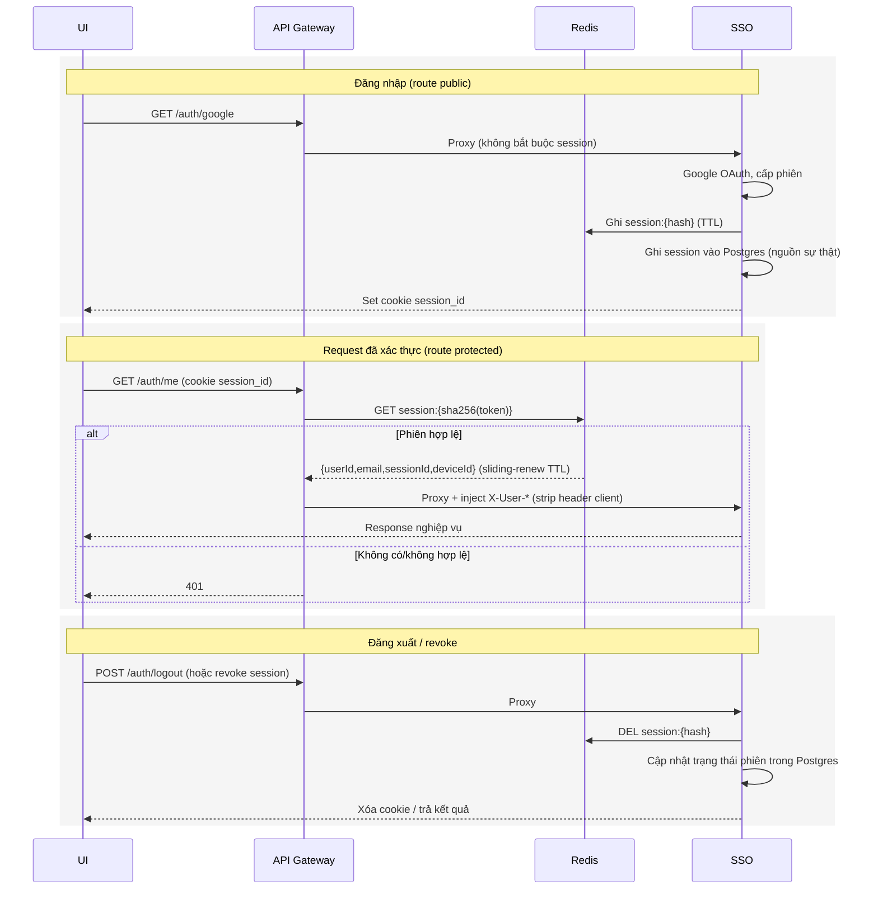
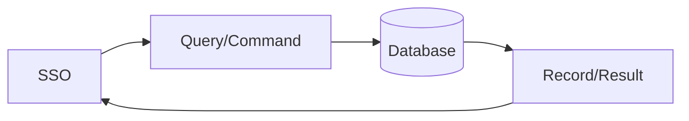
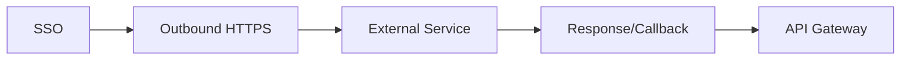
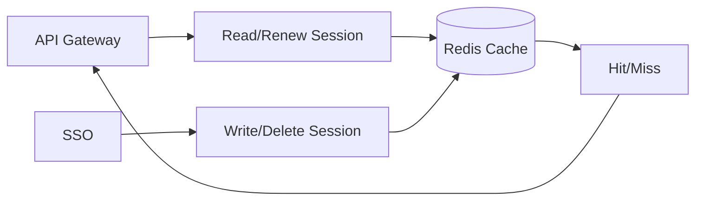

# Kiến trúc hệ thống

## 1. Mục tiêu tài liệu
- Trình bày kiến trúc tổng quát của dự án theo mô hình API Gateway đứng trước service nghiệp vụ.
- Làm rõ vai trò của UI, API Gateway, SSO, Database, Redis Cache, Internet/External.

## 2. Kiến trúc tổng quát toàn dự án (Gateway + SSO)

| Thành phần | Vai trò |
|---|---|
| UI | Nhận thao tác người dùng, hiển thị dữ liệu và gọi API. UI luôn gọi vào API Gateway (cổng public `8000`). |
| API Gateway | Điểm vào public duy nhất (port `8000`). Xử lý edge concerns (CORS allowlist, CSRF Origin/Referer), xác thực edge bằng cookie `session_id` đối chiếu trực tiếp Redis, strip header `X-User-*` do client gửi (chống spoof), inject identity tin cậy rồi proxy `/auth/*` và `/api/*` sang SSO. |
| SSO | Service nội bộ (port `8001`, đổi tên từ `api`). Xử lý đăng nhập Google OAuth, cấp/refresh/switch phiên, quản lý device/account, revoke. Endpoint protected tin cậy header `X-User-Id` do gateway inject thay vì tự validate cookie. |
| Database | Lưu trữ dữ liệu nghiệp vụ và là nguồn sự thật bền vững cho phiên/thiết bị/audit. |
| Redis Cache | Store validate phiên tốc độ cao (`session:{sha256(token)}` -> `{userId,email,sessionId,deviceId}`) cho gateway, cùng dữ liệu cache/token tạm thời. |
| Internet/External | Dịch vụ bên ngoài giao tiếp qua outbound/callback/webhook (callback Google trỏ về gateway). |

> Cô lập "SSO chỉ gọi được qua gateway" bằng network isolation được hoãn sang giai đoạn Docker sau này; local mọi service nằm trên localhost nên đây là hạng mục đã biết, chưa enforce.

## 3. Vai trò các khối chính
| Khối | Input chính | Output chính |
|---|---|---|
| UI | User action, route params | HTTP request tới API Gateway, giao diện hiển thị |
| API Gateway | HTTP request từ UI, callback từ dịch vụ ngoài | Request đã được xác thực + inject identity proxy sang SSO, hoặc 401 nếu thiếu phiên hợp lệ |
| SSO | Request đã proxy kèm header identity tin cậy từ gateway | JSON response, truy vấn DB, ghi/xóa session Redis, gọi dịch vụ ngoài |
| Database | Query/Command từ SSO | Bản ghi dữ liệu |
| Redis Cache | Validate/ghi/xóa session từ gateway và SSO | Dữ liệu session hit/miss theo key |
| Internet/External | Outbound call từ SSO | Response/callback/webhook |

## 4. Kiến trúc chi tiết theo khối

### 4.1 Kiến trúc Frontend

| Node trong sơ đồ | Thành phần và nhiệm vụ |
|---|---|
| Presentation | Page/Component render giao diện và nhận tương tác người dùng. |
| State/Application | Hook/Store/Query quản lý state và điều phối luồng xử lý UI. |
| Integration | API client gọi backend và mapping dữ liệu trả về. |

### 4.2 Kiến trúc API Gateway

| Node trong sơ đồ | Thành phần và nhiệm vụ |
|---|---|
| Edge: CORS/CSRF | Áp dụng CORS allowlist và kiểm tra Origin/Referer chống CSRF cho mọi request public. |
| Edge Auth | Đọc token từ cookie `session_id`, hash SHA-256 và đối chiếu key `session:{hash}` trong Redis; strip mọi header `X-User-*` client gửi rồi inject `X-User-Id`, `X-User-Email`, `X-Session-Id`, `X-Device-Id` tin cậy. Route public (`/auth/google`, `/auth/google/callback`, `/auth/switch`, `/auth/logout`, `/auth/accounts`) đi qua không bắt buộc session; route protected (`/auth/me`, `/auth/devices`, `/auth/sessions/:id`, `/api/*`) thiếu phiên hợp lệ trả 401. |
| Proxy sang SSO | Dùng `http-proxy-middleware` chuyển tiếp `/auth/*` và `/api/*` sang SSO (`SSO_URL`). |

### 4.3 Kiến trúc SSO

| Node trong sơ đồ | Thành phần và nhiệm vụ |
|---|---|
| Presentation | Controller nhận request đã proxy, đọc identity từ header gateway qua `GatewayUserGuard`, trả response chuẩn. |
| Application | Service/Use case điều phối nghiệp vụ xác thực, phiên, device/account. |
| Domain | Entity/Rule/Policy chứa logic nghiệp vụ cốt lõi. |
| Infrastructure | Repository/Client kết nối DB, Redis và dịch vụ ngoài. |

### 4.4 Luồng xác thực qua gateway

> Mô hình phiên: Redis là store validate nhanh (gateway đọc, tự sliding-renew TTL); Postgres là nguồn sự thật bền vững cho liệt kê device/session, remote revoke và audit. Sliding-renew chỉ diễn ra ở Redis nên `expires_at` trong Postgres có thể trễ — chấp nhận được vì listing/audit không cần độ chính xác từng giây.

### 4.5 Kiến trúc Database

| Node trong sơ đồ | Thành phần và nhiệm vụ |
|---|---|
| SSO | Tầng duy nhất được phép đọc/ghi database theo business rule. |
| Query/Command | Lệnh truy vấn/cập nhật dữ liệu do application layer phát sinh. |
| Database | Lưu trữ dữ liệu bền vững, đảm bảo toàn vẹn dữ liệu. |
| Record/Result | Kết quả dữ liệu trả về để SSO chuẩn hóa response. |

### 4.6 Kiến trúc Internet/External

| Node trong sơ đồ | Thành phần và nhiệm vụ |
|---|---|
| SSO | Điều phối tích hợp, kiểm soát timeout/retry/log cho luồng ngoài. |
| Outbound HTTPS | Kênh gọi ra dịch vụ bên ngoài. |
| External Service | Hệ thống thứ ba cung cấp dữ liệu/chức năng tích hợp (vd Google OAuth). |
| Response/Callback | Dữ liệu phản hồi hoặc callback/webhook; callback Google quay lại qua gateway (`API_URL` trỏ về `http://localhost:8000`). |

### 4.7 Kiến trúc Redis Cache

| Node trong sơ đồ | Thành phần và nhiệm vụ |
|---|---|
| API Gateway | Đọc `session:{hash}` để validate edge và sliding-renew TTL. |
| SSO | Ghi session khi create/refresh/switch, xóa key khi logout/revoke. |
| Read/Renew Session | Lớp thao tác đọc + gia hạn TTL của gateway. |
| Write/Delete Session | Lớp thao tác ghi/xóa session của SSO. |
| Redis Cache | Bộ nhớ key-value tốc độ cao cho session và dữ liệu tạm thời. |
| Hit/Miss | Trạng thái phiên còn hợp lệ hay không để quyết định proxy hoặc trả 401. |
