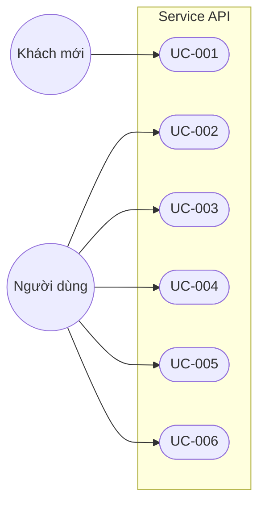
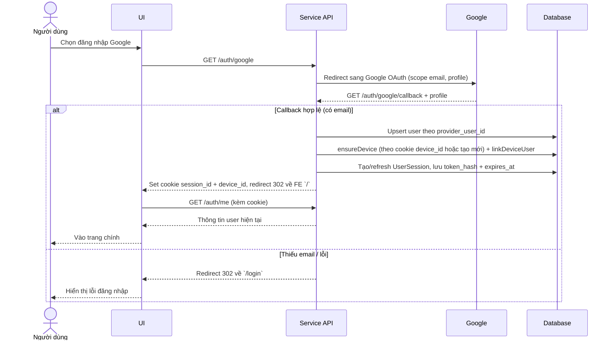
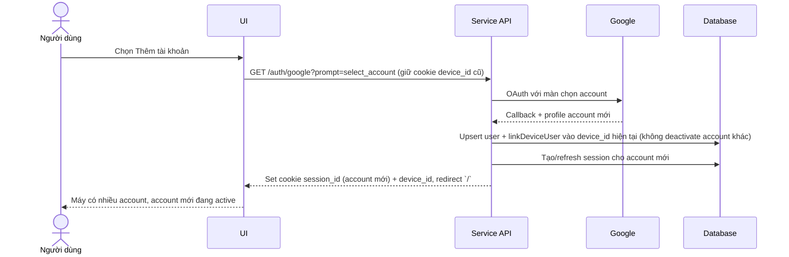
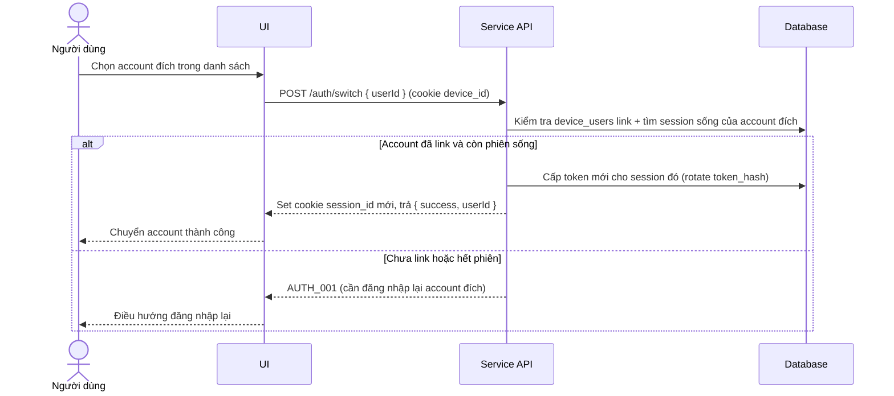
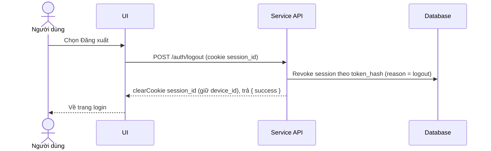
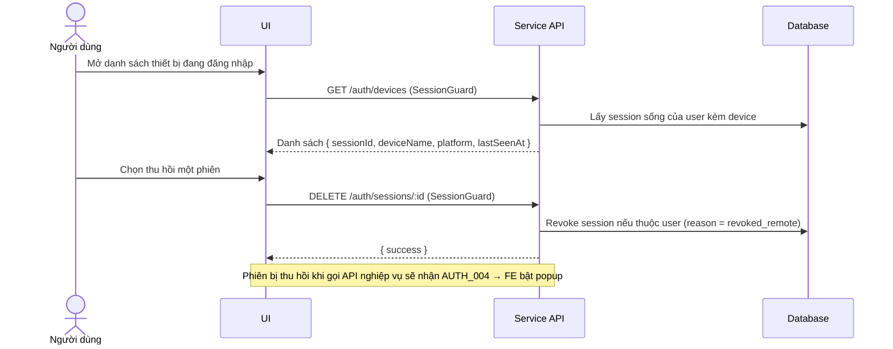
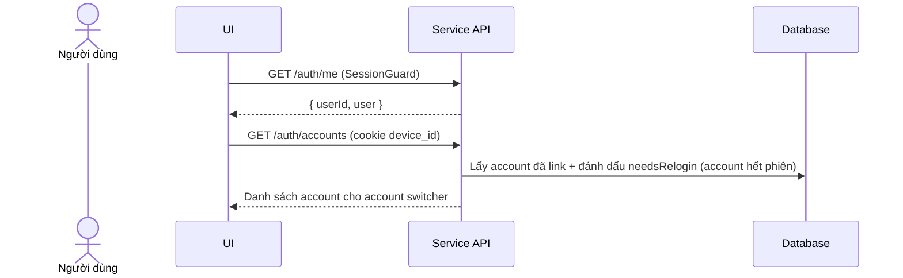

# Thiết kế hệ thống

## 1. Mục tiêu tài liệu
- Thiết kế use case và luồng xử lý cho phạm vi hiện tại: xác thực Google và quản lý phiên đa thiết bị/đa tài khoản bằng **session cookie** (không dùng JWT cho phiên).
- Chuẩn hóa hành vi hệ thống trước khi mở rộng các nghiệp vụ chia tiền/quỹ.

## 2. Mô hình phiên (session model)
- Sau khi Google OAuth thành công, BE tạo `UserSession`, cấp một **token ngẫu nhiên 32 byte** (raw), băm **SHA-256** lưu `user_sessions.token_hash`, và set 2 cookie HttpOnly:
  - `session_id`: chứa token raw (đối chiếu bằng hash), TTL 7 ngày, sliding renew khi còn dưới 1 ngày.
  - `device_id`: chứa UUID `Device`, sống 1 năm để giữ định danh thiết bị qua nhiều phiên.
- Không có access/refresh JWT, không có luồng one-time code exchange. Mọi request bảo vệ chỉ cần gửi kèm 2 cookie trên (`withCredentials`).
- Một thiết bị (`device_id`) có thể liên kết nhiều account (`device_users`); mỗi account có phiên riêng trong `user_sessions`.

## 3. Phạm vi use case hiện tại
| Mã use case | Tên use case | Actor chính | Kết quả đầu ra |
|---|---|---|---|
| UC-001 | Đăng nhập bằng Google | Người dùng | Tạo session hợp lệ, set cookie `session_id`+`device_id` |
| UC-002 | Thêm tài khoản vào máy hiện tại | Người dùng | Liên kết thêm account vào `device_id` hiện tại |
| UC-003 | Chuyển tài khoản active trên cùng máy | Người dùng | Đổi phiên active sang account khác đã link |
| UC-004 | Đăng xuất | Người dùng | Revoke session hiện tại, xóa cookie `session_id` |
| UC-005 | Xem & thu hồi phiên từ xa | Người dùng | Liệt kê thiết bị/phiên, revoke session khác |
| UC-006 | Lấy thông tin user & danh sách account | Người dùng | Trả user hiện tại / account trên device |

## 4. Sơ đồ use case tổng quát

## 5. Luồng chi tiết từng use case

### 5.1 UC-001: Đăng nhập bằng Google

### 5.2 UC-002: Thêm tài khoản vào máy hiện tại

### 5.3 UC-003: Chuyển tài khoản active trên cùng máy

### 5.4 UC-004: Đăng xuất

### 5.5 UC-005: Xem & thu hồi phiên từ xa

### 5.6 UC-006: Lấy thông tin user & danh sách account

## 6. Mapping use case -> thành phần hệ thống
| Use case | Endpoint | Service chính | Dữ liệu liên quan |
|---|---|---|---|
| UC-001 | `GET /auth/google`, `GET /auth/google/callback` | AuthService, DeviceService, SessionService | users, devices, device_users, user_sessions |
| UC-002 | `GET /auth/google` (`prompt=select_account`) | AuthService, DeviceService, SessionService | users, device_users, user_sessions |
| UC-003 | `POST /auth/switch` | SessionService | device_users, user_sessions |
| UC-004 | `POST /auth/logout` | SessionService | user_sessions |
| UC-005 | `GET /auth/devices`, `DELETE /auth/sessions/:id` | SessionService | user_sessions, devices |
| UC-006 | `GET /auth/me`, `GET /auth/accounts` | AuthService, DeviceService, SessionService | users, device_users, user_sessions |

## 7. Bảng endpoint hiện có
| Method & Path | Bảo vệ | Mô tả |
|---|---|---|
| `GET /auth/google` | Public | Bắt đầu OAuth Google. |
| `GET /auth/google/callback` | GoogleAuthGuard | Nhận callback, tạo session, set cookie, redirect FE `/`. |
| `POST /auth/switch` | Cookie `device_id` | Đổi account active trên device. |
| `POST /auth/logout` | Cookie `session_id` | Revoke session hiện tại. |
| `GET /auth/accounts` | Cookie `device_id` | Danh sách account trên device + `needsRelogin`. |
| `GET /auth/me` | SessionGuard | Thông tin user hiện tại. |
| `GET /auth/devices` | SessionGuard | Danh sách thiết bị/phiên của user. |
| `DELETE /auth/sessions/:id` | SessionGuard | Thu hồi phiên từ xa nếu thuộc user. |
| `GET /users` | SessionGuard | `[DEMO]` endpoint nghiệp vụ minh hoạ popup hết phiên. |

## 8. Quy tắc triển khai cho scope hiện tại
- Chỉ triển khai xác thực Google + quản lý phiên (UC-001..006); chưa triển khai nghiệp vụ chia tiền/quỹ.
- Rate limit: global 60 req/60s; nhóm `/auth` giới hạn 10 req/60s.
- Mọi thay đổi phạm vi phải cập nhật đồng thời tài liệu `Phiên bản`.
