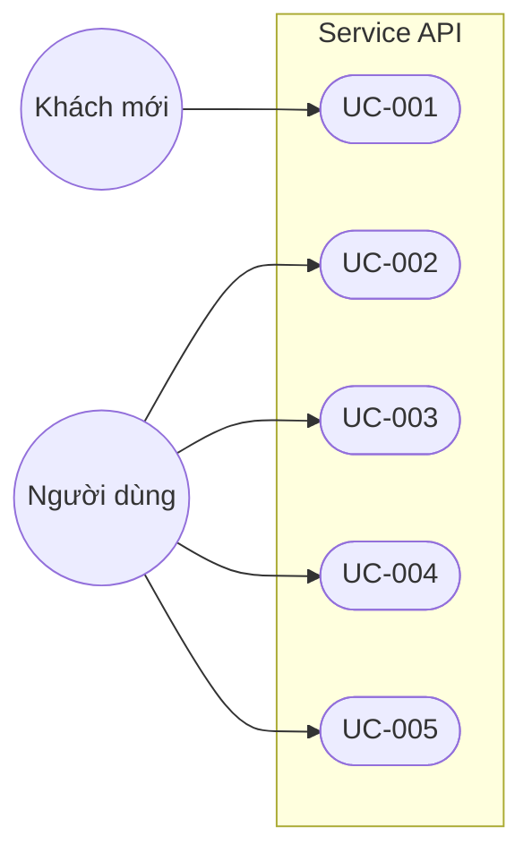
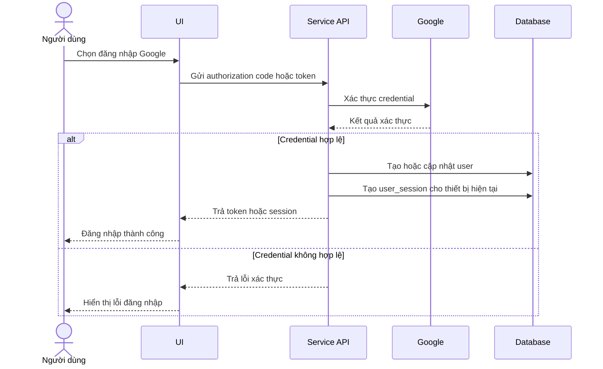
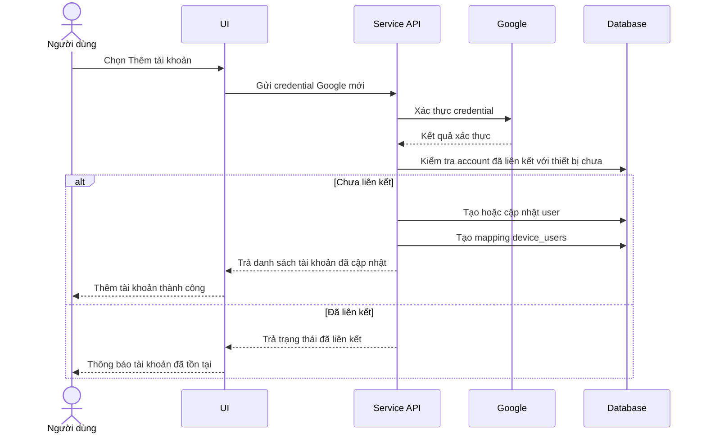
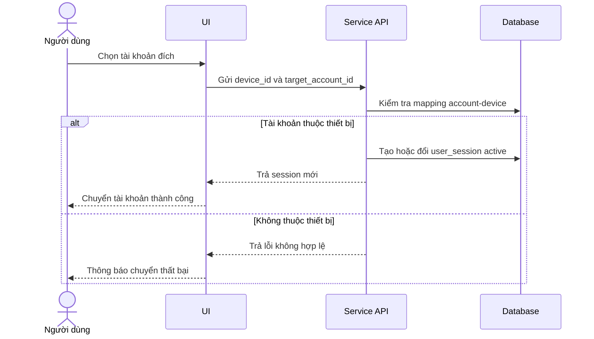
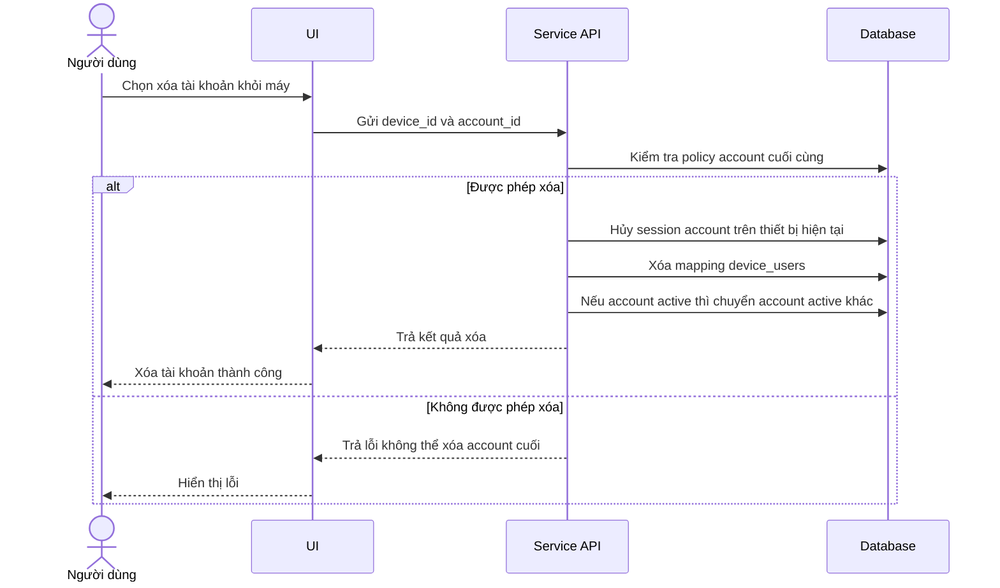
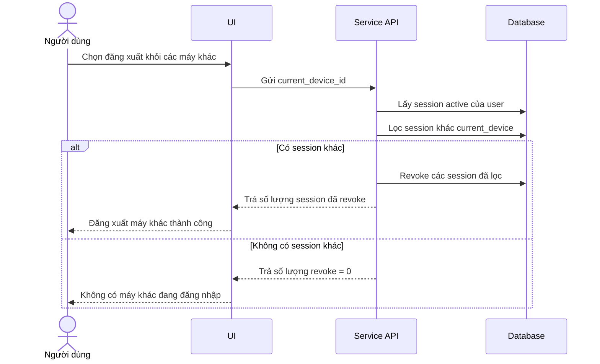

# Thiết kế hệ thống

## 1. Mục tiêu tài liệu
- Thiết kế use case và luồng xử lý cho phạm vi hiện tại: xác thực Google và quản lý phiên đa thiết bị/đa tài khoản.
- Chuẩn hóa hành vi hệ thống trước khi mở rộng các nghiệp vụ khác.

## 2. Phạm vi use case hiện tại
| Mã use case | Tên use case | Actor chính | Kết quả đầu ra |
|---|---|---|---|
| UC-001 | Đăng nhập bằng Google | Người dùng | Tạo phiên đăng nhập hợp lệ |
| UC-002 | Thêm tài khoản vào máy hiện tại | Người dùng | Máy có nhiều tài khoản đã liên kết |
| UC-003 | Chuyển tài khoản trên cùng máy | Người dùng | Đổi phiên hoạt động sang tài khoản khác |
| UC-004 | Xóa tài khoản khỏi máy | Người dùng | Gỡ liên kết tài khoản khỏi thiết bị hiện tại |
| UC-005 | Đăng xuất khỏi các máy khác | Người dùng | Vô hiệu phiên ở các thiết bị khác |

## 3. Sơ đồ use case tổng quát

## 4. Luồng chi tiết từng use case

### 4.1 UC-001: Đăng nhập bằng Google

### 4.2 UC-002: Thêm tài khoản vào máy hiện tại

### 4.3 UC-003: Chuyển tài khoản trên cùng máy

### 4.4 UC-004: Xóa tài khoản khỏi máy

### 4.5 UC-005: Đăng xuất khỏi các máy khác

## 5. Mapping use case -> module hệ thống
| Use case | Module chính | Dữ liệu liên quan |
|---|---|---|
| UC-001 | Auth Module | users, user_sessions |
| UC-002 | Device User Module | devices, device_users, user_sessions |
| UC-003 | Session Switch Module | device_users, user_sessions |
| UC-004 | Device User Module | device_users, user_sessions |
| UC-005 | Session Security Module | user_sessions |

## 6. Quy tắc triển khai cho scope hiện tại
- Chỉ triển khai các API phục vụ UC-001 đến UC-005.
- Chưa triển khai các nghiệp vụ chia tiền/quỹ ở phiên bản này.
- Mọi thay đổi phạm vi phải cập nhật đồng thời tài liệu `Phiên bản`.
