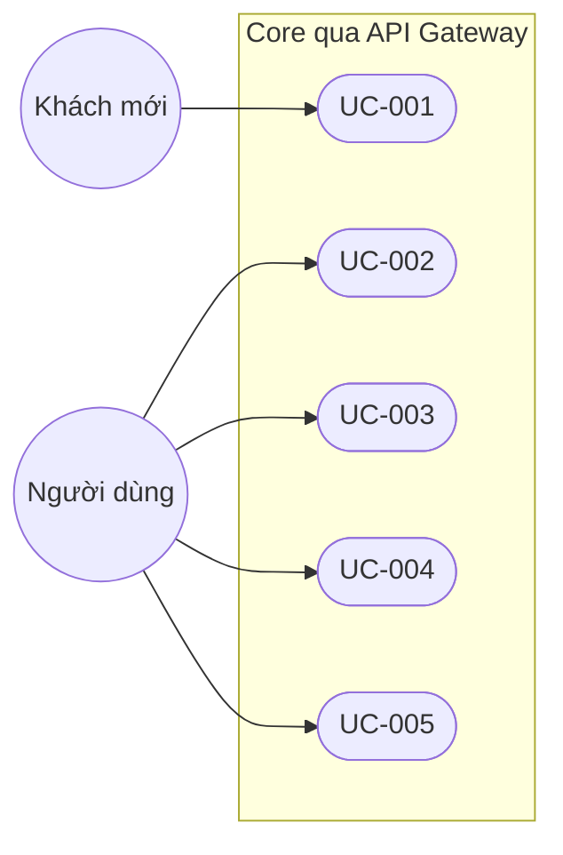
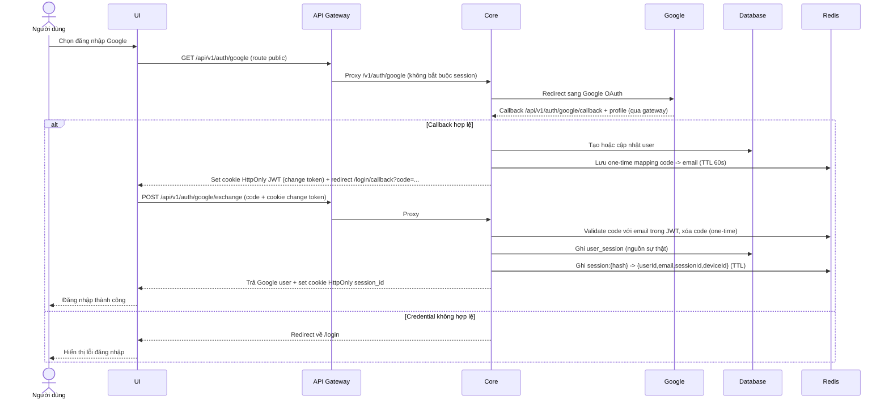
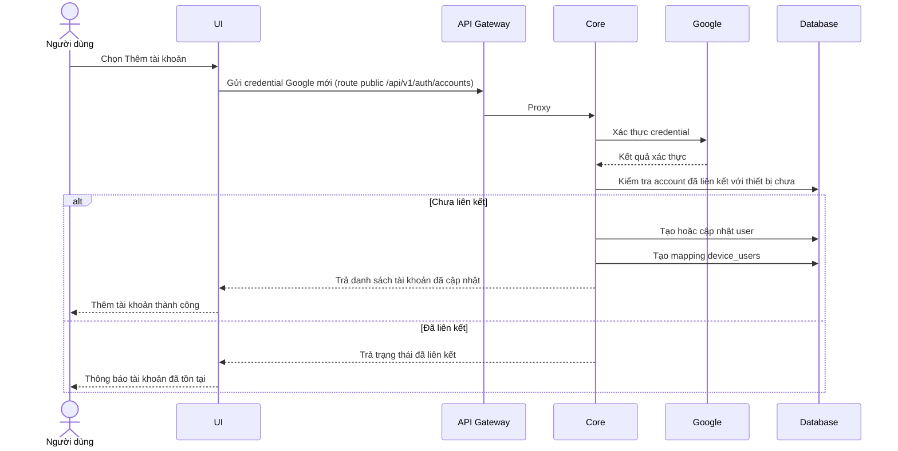
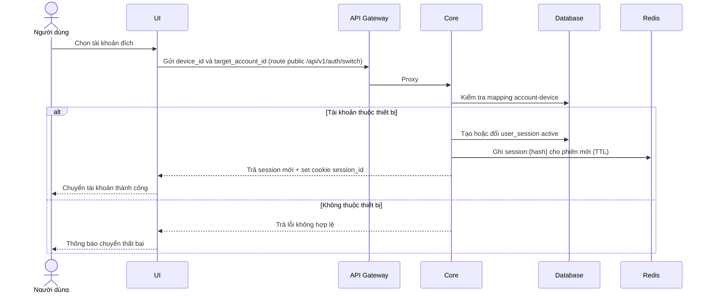
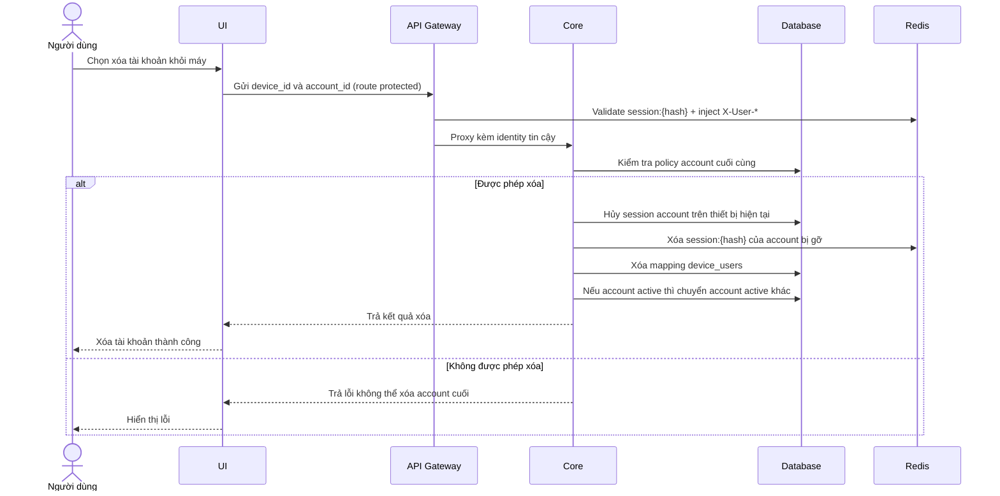
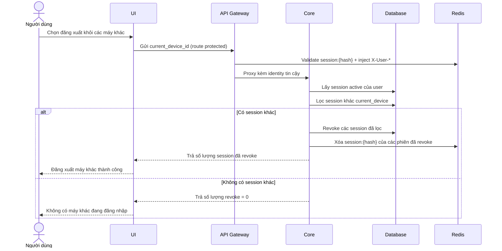

# Thiết kế hệ thống

## 1. Mục tiêu tài liệu
- Thiết kế use case và luồng xử lý cho phạm vi hiện tại: xác thực Google và quản lý phiên đa thiết bị/đa tài khoản.
- Chuẩn hóa hành vi hệ thống trước khi mở rộng các nghiệp vụ khác.

## 2. Phạm vi use case hiện tại
| Mã use case | Tên use case | Actor chính | Kết quả đầu ra |
|---|---|---|---|
| UC-001 | Đăng nhập bằng Google | Người dùng | Tạo phiên đăng nhập hợp lệ |
| UC-002 | Thêm tài khoản vào máy hiện tại | Người dùng | Máy có nhiều tài khoản đã liên kết |
| UC-003 | Chuyển tài khoản trên cùng máy | Người dùng | Đổi phiên hoạt động sang tài khoản khác |
| UC-004 | Xóa tài khoản khỏi máy | Người dùng | Gỡ liên kết tài khoản khỏi thiết bị hiện tại |
| UC-005 | Đăng xuất khỏi các máy khác | Người dùng | Vô hiệu phiên ở các thiết bị khác |

## 3. Sơ đồ use case tổng quát

## 3.1 Vai trò API Gateway trong luồng xác thực
- Mọi request từ UI đều đi qua **API Gateway** (cổng public `8000`) trước khi tới **Core** (port nội bộ `8001`).
- Gateway xử lý edge: CORS allowlist, kiểm tra CSRF Origin/Referer, đọc cookie `session_id`, đối chiếu `session:{sha256(token)}` trong Redis, strip header `X-User-*` do client gửi rồi inject identity tin cậy (`X-User-Id`, `X-User-Email`, `X-Session-Id`, `X-Device-Id`).
- `/api` là namespace public duy nhất; gateway strip prefix `/api` rồi forward `/v1/...` sang core (versioning đặt ở cấp controller `v1/auth`, `v1/users`). Route public (`/api/v1/auth/google`, `/api/v1/auth/google/callback`, `/api/v1/auth/switch`, `/api/v1/auth/logout`, `/api/v1/auth/accounts`) đi qua không bắt buộc session; route protected (`/api/v1/auth/me`, `/api/v1/auth/devices`, `/api/v1/auth/sessions/:id`, `/api/v1/users` và mọi `/api/v1/...` khác) thiếu phiên hợp lệ sẽ bị gateway trả 401.
- Core không tự validate cookie nữa mà tin cậy header `X-User-Id` của gateway qua `GatewayUserGuard`. Khi create/refresh/switch, core ghi session vào **cả Redis** (validate nhanh, có TTL) **và Postgres** (nguồn sự thật cho liệt kê device/session, remote revoke, audit); khi logout/revoke thì xóa key Redis.
- Trong các sequence dưới đây, `API as Core` là phần nghiệp vụ phía sau gateway; gateway chỉ được vẽ tách riêng ở các luồng cần làm rõ xác thực edge.

## 4. Luồng chi tiết từng use case

### 4.1 UC-001: Đăng nhập bằng Google

### 4.2 UC-002: Thêm tài khoản vào máy hiện tại

### 4.3 UC-003: Chuyển tài khoản trên cùng máy

### 4.4 UC-004: Xóa tài khoản khỏi máy

### 4.5 UC-005: Đăng xuất khỏi các máy khác

## 5. Mapping use case -> module hệ thống
| Use case | Module chính | Dữ liệu liên quan |
|---|---|---|
| UC-001 | Auth Module | users, user_sessions |
| UC-002 | Device User Module | devices, device_users, user_sessions |
| UC-003 | Session Switch Module | device_users, user_sessions |
| UC-004 | Device User Module | device_users, user_sessions |
| UC-005 | Session Security Module | user_sessions |

## 6. Quy tắc triển khai cho scope hiện tại
- Chỉ triển khai các API phục vụ UC-001 đến UC-005.
- Chưa triển khai các nghiệp vụ chia tiền/quỹ ở phiên bản này.
- Mọi thay đổi phạm vi phải cập nhật đồng thời tài liệu `Phiên bản`.
